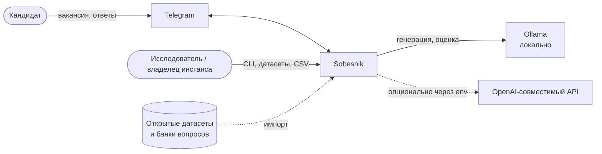
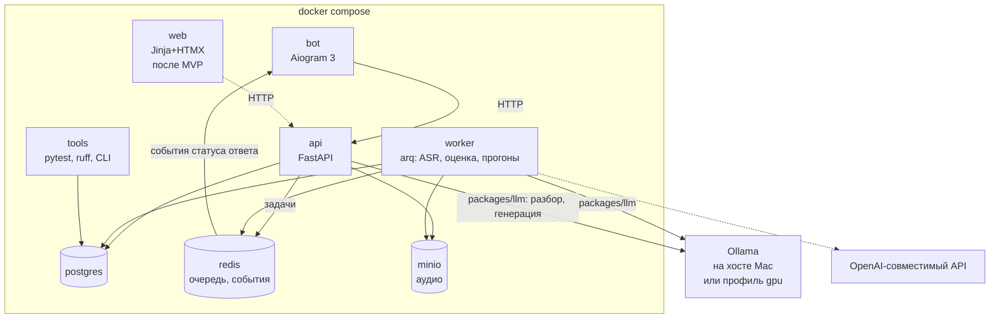

# 000. Общая спецификация Sobesnik

Статус: черновик · 30.09.2026

Документ задаёт рамку: что строим, из каких частей и как поймём, что MVP готов.
Детальные спеки модулей (`001-…`, `002-…`) пишутся перед стартом соответствующего спринта
(см. [roadmap](../roadmap.md)) и могут уточнять этот документ. Если уточнение противоречит
тексту ниже, сначала правится этот документ.

## 1. Цель и границы

Sobesnik — self-hosted тренажёр технических собеседований для кандидата. Пользователь присылает
текст вакансии. Система выделяет стек и уровень, задаёт вопросы под эту вакансию, принимает ответ
текстом или голосом, оценивает его языковой моделью по рубрике и ведёт прогресс по темам.

Второе назначение — стенд для проверки качества автоматической оценки на открытых данных.
Это исследовательская часть ВКР, поэтому возможность воспроизвести и сравнить оценки
закладывается в модель данных с первого дня, а не добавляется потом.

**MVP:**
- разбор вакансии и генерация вопросов;
- ответ текстом и голосом (faster-whisper);
- оценка по рубрике с обоснованием;
- прогресс по темам и сессия повторения слабых тем;
- Telegram-бот как единственный пользовательский интерфейс;
- слой LLM: Ollama по умолчанию, OpenAI-совместимый API через env;
- инструменты исследователя: импорт открытого датасета, перепрогон оценок другой моделью, выгрузка в CSV;
- развёртывание через `docker compose` на Mac (Apple Silicon) и на Linux-сервере с GPU.

**После MVP:**
- веб-кабинет на Jinja + HTMX — первый шаг после MVP (требования в §4.7);
- импорт вакансий через публичный API hh.ru;
- интервальное повторение (SM-2 и аналоги) вместо простого правила «слабая тема»;
- провайдер vLLM, мониторинг (Prometheus/Grafana), несколько языков интерфейса;
- live-coding и задачи с кодом — не планируются.

## 2. Термины

| Термин | Значение |
|---|---|
| Вакансия | исходный текст и разобранный из него профиль: стек, уровень, требования |
| Тема | элемент фиксированного справочника (`python.asyncio`, `db.indexes`, …); к теме привязаны вопросы и прогресс |
| Сессия | одна тренировка: упорядоченный набор вопросов по вакансии или по слабым темам |
| Ответ | текст ответа пользователя; для голоса — аудио и транскрипт |
| Оценка | результат прогона ответа через рубрику конкретной моделью; у одного ответа может быть много оценок |
| Прогон (eval run) | пакетная переоценка набора ответов заданной моделью и версией рубрики |

## 3. Пользовательские сценарии

**С1. Первый запуск и вакансия.** Пользователь отправляет боту `/start` и получает короткую инструкцию.
Затем вставляет текст вакансии. Бот показывает, что понял: должность, уровень, стек, 5–10 ключевых
требований. Уровень можно поправить кнопками.

**С2. Тренировка текстом.** Пользователь нажимает «Начать тренировку». Бот создаёт сессию из N вопросов
(по умолчанию 5) и присылает первый. Пользователь отвечает текстом. Бот сразу подтверждает приём,
показывает «печатает…» и статус обработки, через несколько секунд присылает оценку: итоговый балл, баллы по критериям, что упущено,
короткий совет. Затем идёт следующий вопрос. В конце — сводка по сессии.

**С3. Тренировка голосом.** То же, но ответ — голосовое сообщение. Бот присылает транскрипт,
и пользователь видит, что именно распознано. Потом приходит оценка. Если распознавание не удалось,
бот просит повторить или ответить текстом.

**С4. Прогресс.** По команде `/progress` бот показывает темы со средним баллом и числом попыток.
Слабые темы выделены. Отдельно — последние сессии.

**С5. Повторение слабых тем.** По команде `/repeat` создаётся сессия только по слабым темам.
Вопросы новые, но по тем же темам. После каждой оценки прогресс темы пересчитывается,
и тема может перестать быть слабой.

**С6. Управление своими данными.** По команде `/forget` удаляются аудио и транскрипты пользователя
(или всё, по выбору). Аудио также удаляется автоматически по TTL.

**С7. Исследователь.** Владелец инстанса через CLI в контейнере `tools` (или через защищённые эндпоинты):
1. импортирует открытый датасет с вопросами, эталонными ответами и, если есть, человеческими оценками;
2. запускает прогон: «оценить все ответы датасета моделью X по рубрике v1»;
3. повторяет прогон с другой моделью и с другими транскриптами (эталонный или ASR);
4. выгружает результаты в CSV для анализа в `research/`.

## 4. Функциональные требования

Нумерация сквозная внутри модуля, чтобы на требования можно было ссылаться из спек и тестов.

### 4.1. Вакансия (VAC)
- VAC-1. Принимает произвольный текст вакансии на русском или английском длиной до 20 000 символов.
- VAC-2. Возвращает профиль: должность, уровень (`intern|junior|middle|senior|lead`), нормализованный стек,
  список требований. У каждого требования есть текст, тема из справочника и признак «обязательно / желательно».
- VAC-3. Если текст не похож на вакансию, возвращается понятная ошибка, а не пустой профиль.
- VAC-4. Пользователь может поправить уровень и удалить лишние требования. Правка сохраняется в профиле.
- VAC-5. Хранятся исходный текст, модель и версия промпта, которыми сделан разбор.

### 4.2. Генерация вопросов (GEN)
- GEN-1. По профилю вакансии генерируется N вопросов (N = 3…15, по умолчанию 5). Вопросы распределены
  по требованиям, обязательные требования — в приоритете.
- GEN-2. Каждый вопрос привязан к теме и к требованию вакансии, сложность соответствует уровню.
- GEN-3. Вместе с вопросом генерируются 3–6 ключевых пунктов ожидаемого ответа. Оценщик использует их
  как эталон, когда эталонного ответа нет.
- GEN-4. Внутри сессии вопросы не повторяются. При повторении темы генерируется новый вопрос,
  а не показывается старый.
- GEN-5. Хранятся модель и версия промпта генерации.
- GEN-6 (желательно). Если в импортированном банке есть вопрос по теме, его можно подмешать вместе с эталонным ответом.

### 4.3. Ответ и распознавание речи (ANS, ASR)
- ANS-1. Ответ текстом: до 5 000 символов.
- ANS-2. Ответ голосом: ogg/opus (Telegram), webm, mp3, wav; до 5 минут.
- ANS-3. Обработка асинхронная: API сразу отвечает `202` с идентификатором, дальше работает воркер.
  Статусы: `received → transcribing → evaluating → done | failed`. Каждая смена статуса публикуется
  событием в Redis, чтобы интерфейс показывал этап обработки (BOT-6).
- ASR-1. Аудио сохраняется в S3-совместимое хранилище (MinIO), транскрипт — в БД со ссылкой на аудио.
- ASR-2. Модель faster-whisper задаётся через env. Язык по умолчанию — `ru`, с автоопределением как запасным вариантом.
- ASR-3. У транскрипта хранятся модель ASR, язык, длительность и средняя уверенность. У одного аудио может быть
  несколько транскриптов разных видов: `asr` и `reference` (эталонная ручная расшифровка).
- ASR-4. До 3 повторов при сбое. После этого ответ переходит в `failed`, пользователь получает сообщение.
- ASR-5. Аудио удаляется по TTL (env, по умолчанию 30 дней) и по `/forget`. Аудио и транскрипты не пишутся в логи.

### 4.4. Оценка по рубрике (EVAL)
- EVAL-1. Оценка выполняется по рубрике (§8) и возвращает баллы по каждому критерию с обоснованием,
  итоговый балл 0–100, список упущенных пунктов и совет.
- EVAL-2. Ответ модели — JSON по схеме. Невалидный JSON повторяется до 2 раз, дальше оценка получает статус `failed`.
- EVAL-3. У каждой оценки хранятся версия рубрики, провайдер, модель, версия промпта, параметры генерации
  (temperature, seed), сырой ответ модели, задержка и число токенов.
- EVAL-4. Оценка не изменяется: переоценка создаёт новую запись. Пользователю показывается последняя
  оценка «боевой» конфигурации.
- EVAL-5. Для голосового ответа оценивается транскрипт. Оценка ссылается на конкретный транскрипт.
- EVAL-6. Прогон (eval run): выбрать набор ответов по фильтру (датасет, сессия, период), модель, рубрику
  и вид транскрипта, затем переоценить пакетно. Прогон можно перезапустить, и уже готовые оценки он пропускает.
- EVAL-7. Выгрузка оценок в CSV: одна строка на пару «оценка × критерий» или «оценка» (длинный и широкий формат).
  Вместе с ответом выгружаются эталон и человеческая оценка из датасета, если они есть.
- EVAL-8. Импорт открытого датасета из JSONL в едином формате (вопрос, эталонный ответ, ответ, человеческие оценки,
  шкала, язык, источник, лицензия). Для каждого источника пишется конвертер в `research/`.

### 4.5. Прогресс и повторение (PRG)
- PRG-1. После каждой оценки пересчитывается прогресс темы: число попыток, последний балл, среднее по трём последним.
- PRG-2. Тема слабая, если среднее по трём последним попыткам меньше 60 или последний балл меньше 50.
  Пороги задаются в конфиге.
- PRG-3. Сессия повторения: до N слабых тем, начиная с самых низких, по одному новому вопросу на тему.
- PRG-4. История сессий: дата, вакансия, баллы по вопросам.

### 4.6. Telegram-бот (BOT)
- BOT-1. Команды: `/start`, `/new` (новая вакансия), `/train`, `/repeat`, `/progress`, `/forget`, `/help`.
- BOT-2. Пользователь определяется по `telegram_id` и создаётся при первом обращении.
- BOT-3. Бот — тонкий клиент API: бизнес-логики в нём нет. К API он обращается с сервисным токеном.
- BOT-4. Приём ответа подтверждается сразу (до 2 с). Результат бот получает событием из Redis от воркера.
- BOT-5. Доступ к боту можно ограничить списком `telegram_id` через env (закрытый инстанс).
- BOT-6. Пользователь всегда видит, что бот работает, а не завис:
  - на всё время любой долгой операции (разбор вакансии, генерация, распознавание, оценка) бот показывает
    индикатор «печатает…» (`sendChatAction: typing`) и повторяет его каждые ~4 с, потому что Telegram гасит
    индикатор через 5 с;
  - в ответ на голосовое бот сразу присылает одно статусное сообщение и редактирует его по событиям воркера:
    «🎧 Распознаю речь…» → «🧠 Оцениваю ответ…» → результат. Для текста то же сообщение, но начинается
    со второго шага. Отдельного статуса «слушает» в Telegram нет, `record_voice` не используем: он означает
    «записывает голосовое» и вводит в заблуждение;
  - если обработка идёт дольше 60 с, статус дополняется: «Модель думает дольше обычного, ответ сохранён».
    Если сбой — сообщение об ошибке вместо статуса, индикатор снимается.

### 4.7. Веб-кабинет (WEB, после MVP)
- WEB-1. Серверный рендеринг Jinja + HTMX внутри `apps/web`, работает через тот же API.
- WEB-2. Сценарии С1–С6 в браузере. Запись голоса через MediaRecorder (webm/opus).
- WEB-3. Вход по одноразовой ссылке из бота (привязка к тому же пользователю) и локальный вход без Telegram
  для полностью офлайн-режима.

## 5. Нефункциональные требования

**Локальность.** Всё работает на Ollama без облачных ключей. Облачный OpenAI-совместимый API включается
только через env (`LLM_PROVIDER`, `LLM_BASE_URL`, `LLM_API_KEY`, `LLM_MODEL`); модели для генерации
и оценки можно задать раздельно. Тесты облако не требуют.

**Приватность.** Голос и ответы хранятся только в Postgres и MinIO своего инстанса. Ограничение, которое
надо честно показывать пользователю: при работе через Telegram голосовое сообщение проходит через серверы
Telegram. Полностью офлайн-сценарий — веб-кабинет (после MVP).

**Железо.**

| Среда | Минимум | Как запускается |
|---|---|---|
| Разработка | Mac на Apple Silicon, 16 ГБ RAM | Ollama нативно на хосте (Metal), whisper в контейнере на CPU |
| Сервер | Linux, NVIDIA от 8 ГБ VRAM (лучше 12–16) | Ollama и whisper в compose-профиле `gpu` |
| Без GPU | 4+ ядра, 16 ГБ RAM | маленькая модель (≤ 4B) и whisper `small`, заметная деградация, замеряется в спринте 5 |

**Ориентиры по времени** (модель 7–9B, Q4). Это цели, а не SLA; реальные цифры замеряются и записываются.

| Операция | Mac M-серии | Сервер с GPU |
|---|---|---|
| Разбор вакансии | ≤ 30 с | ≤ 10 с |
| Генерация 5 вопросов | ≤ 40 с | ≤ 15 с |
| Оценка одного ответа | ≤ 30 с | ≤ 10 с |
| Распознавание 1 минуты речи | ≤ 30 с (CPU) | ≤ 5 с |
| Подтверждение приёма в боте | ≤ 2 с | ≤ 2 с |

**Надёжность.** Таймауты и ретраи на вызовах LLM и ASR. Если LLM недоступна, бот пишет понятное сообщение,
ответ сохраняется и оценивается, когда LLM вернётся.

**Воспроизводимость.** Для оценки temperature = 0 и фиксированный seed. Промпты и рубрики лежат в репозитории
и версионируются. Любую оценку можно воспроизвести по сохранённой конфигурации.

**Эксплуатация.** Весь инстанс поднимается `docker compose up -d`. Конфигурация через `.env`,
пример в `deploy/.env.example`. Логи структурированные (JSON), без текста ответов и аудио.

## 6. Архитектура

### Контекст

### Контейнеры

Код распределён по пакетам так:
- `packages/core` — сущности, рубрики, правила прогресса, без I/O;
- `packages/llm` — интерфейс `LLMProvider` и провайдеры `ollama` и `openai_compatible`;
- `packages/asr` — интерфейс `Transcriber` и провайдер faster-whisper.

`apps/api` и worker собираются из одного образа с разными командами запуска.

Разбор вакансии и генерация вопросов в MVP выполняются синхронно в запросе, в пределах таймаута.
Если они не уложатся в ориентиры, их перенесут в воркер. Решение принимается в спринте 2.

## 7. Модель данных (черновик)

| Таблица | Ключевые поля |
|---|---|
| `user` | id, telegram_id (unique, null), created_at, settings jsonb |
| `topic` | id, slug (unique), title, parent_id — справочник, сидится из YAML |
| `vacancy` | id, user_id, raw_text, title, level, stack text[], parser_model, prompt_version, created_at |
| `requirement` | id, vacancy_id, text, topic_id, is_required |
| `question` | id, topic_id, requirement_id (null), text, key_points jsonb, reference_answer (null), source `generated\|bank\|dataset`, dataset_item_id (null), gen_model, prompt_version |
| `session` | id, user_id, vacancy_id (null), mode `vacancy\|repeat`, status, created_at, finished_at |
| `session_question` | session_id, question_id, position |
| `answer` | id, question_id, session_id (null), user_id (null), source `user\|dataset`, kind `text\|voice`, text (null), status, created_at |
| `audio` | id, answer_id, s3_key, mime, duration_s, expires_at |
| `transcript` | id, audio_id, kind `asr\|reference`, text, asr_model (null), language, avg_logprob, created_at |
| `evaluation` | id, answer_id, transcript_id (null), eval_run_id (null), rubric_version, provider, model, prompt_version, params jsonb, scores jsonb, total, feedback jsonb, raw_response, latency_ms, tokens_in, tokens_out, status, created_at |
| `eval_run` | id, name, provider, model, rubric_version, transcript_kind, filter jsonb, status, created_at |
| `dataset` | id, name, source_url, license, lang, score_scale, imported_at |
| `dataset_item` | id, dataset_id, external_id, human_scores jsonb — связывает импортированные вопросы и ответы с исходником |
| `topic_progress` | user_id, topic_id, attempts, last_score, avg_last3, is_weak, updated_at |

Ответ из датасета — обычный `answer` с `source = dataset` и без пользователя. Благодаря этому
боевой конвейер и эксперименты используют один и тот же код оценки.

## 8. API (MVP, префикс `/api/v1`)

| Метод и путь | Назначение |
|---|---|
| `GET /health`, `GET /health/llm` | живость сервиса и доступность LLM |
| `PUT /users/telegram/{telegram_id}` | найти или создать пользователя (бот) |
| `POST /vacancies` | разобрать текст вакансии → профиль |
| `GET /vacancies/{id}`, `PATCH /vacancies/{id}` | профиль, правка уровня и требований |
| `POST /sessions` | создать сессию: `{vacancy_id, n}` или `{mode: "repeat", n}` → вопросы |
| `GET /sessions/{id}` | сессия, вопросы, статусы ответов |
| `POST /sessions/{id}/finish` | завершить, получить сводку |
| `POST /sessions/{id}/questions/{qid}/answer` | ответ текстом → `202 {answer_id}` |
| `POST /sessions/{id}/questions/{qid}/answer/voice` | ответ голосом (multipart) → `202 {answer_id}` |
| `GET /answers/{id}` | статус, транскрипт, последняя оценка |
| `GET /users/{id}/progress` | прогресс по темам, слабые темы, история сессий |
| `DELETE /users/{id}/data?scope=audio\|all` | `/forget` |

Служебные эндпоинты (админ-токен; те же операции доступны через CLI в `tools`):

| Метод и путь | Назначение |
|---|---|
| `POST /admin/datasets` | импорт датасета из JSONL |
| `POST /admin/eval-runs` | запустить прогон: модель, рубрика, вид транскрипта, фильтр |
| `GET /admin/eval-runs/{id}` | статус и прогресс прогона |
| `GET /admin/evaluations.csv` | выгрузка по фильтру (run, датасет, модель, период) |

Авторизация в MVP: бот ходит с сервисным токеном и передаёт `user_id`, служебные эндпоинты требуют админ-токен.
Пользовательская авторизация появится вместе с веб-кабинетом.

## 9. Рубрика v1 (черновик)

Рубрика хранится в `packages/core/rubrics/v1.yaml`. Версия — это номер плюс хеш файла.
Любое изменение текста рубрики — новая версия.

| Критерий | Вес | 0 | 1 | 2 | 3 |
|---|---|---|---|---|---|
| Корректность | 0.30 | грубые ошибки | есть существенные ошибки | мелкие неточности | ошибок нет |
| Полнота | 0.25 | ключевые пункты не раскрыты | раскрыта меньшая часть | большая часть | все ключевые пункты |
| Глубина | 0.20 | только определение | «что», без «почему» | объяснены причины и компромиссы | компромиссы, границы применимости, пример из практики |
| Терминология | 0.15 | термины неверны или отсутствуют | путаница в терминах | в целом точно | точно и уместно |
| Структура | 0.10 | не удаётся понять | сбивчиво | понятно, но с перескоками | логично: тезис → объяснение → пример |

- Итог = Σ(вес × балл / 3) × 100, округление до целого.
- Вопрос считается проваленным, если итог меньше 50 или корректность не выше 1.
- Эталон для «полноты» — `key_points` вопроса или `reference_answer`, если он есть.
- Устная речь не штрафуется: слова-паразиты, самоисправления и огрехи распознавания не влияют на
  «структуру» и «терминологию», если смысл восстанавливается. Это важно для сравнения оценок
  по эталонной и ASR-транскрипции.
- Формат ответа модели: для каждого критерия сначала `reason`, потом `score` (0–3). Дальше
  `missed_points[]` и `advice`. Итог считает код, а не модель.
- Для сравнения со шкалами датасетов (например 0–5) правило перевода фиксируется в спеке спринта 5.

## 10. Заделы под проверку качества

Это закладывается сразу, до исследовательского спринта:

1. У каждой оценки хранятся версии рубрики и промпта, провайдер, модель, параметры и сырой ответ (EVAL-3).
2. Оценки не переписываются, а добавляются. Можно держать сколько угодно оценок одного ответа (EVAL-4).
3. Транскрипт лежит отдельно от аудио и бывает двух видов, `asr` и `reference`. Оценка ссылается
   на конкретный транскрипт (ASR-3, EVAL-5). Так считается влияние ошибок распознавания речи.
4. Прогоны: переоценить любой набор ответов другой моделью или рубрикой одной командой (EVAL-6).
5. Импорт открытого датасета в единый JSONL-формат (EVAL-8). Ответы из датасета проходят тот же конвейер.
6. Выгрузка в CSV со всеми полями, нужными для анализа в `research/` (EVAL-7).

Кандидаты в открытые данные (лицензии проверяются в спринте 5):
- short answer grading с человеческими оценками: Mohler (CS, данные структур), SemEval-2013 Task 7 (SciEntsBank, Beetle);
- русскоязычные банки вопросов с ответами на GitHub (Python, Java, базы данных);
- речь для проверки ASR: Golos, Common Voice (ru), а также собственные записи ответов с ручной расшифровкой.

## 11. Критерии приёмки MVP

1. На чистом Mac на Apple Silicon с Docker и Ollama инстанс поднимается по README не более чем за 3 команды
   (не считая скачивания моделей).
2. В боте проходится полный путь С1 → С2 → С3 → С4 → С5 на реальной вакансии без ошибок и ручного вмешательства.
3. Голосовой ответ длиной 1 минута распознаётся и оценивается. Транскрипт и оценка видны пользователю.
4. Все значения ориентиров из §5 замерены на Mac и записаны. Отклонения объяснены.
5. Смена `LLM_PROVIDER` и `LLM_BASE_URL` в `.env` переключает оценку на другой OpenAI-совместимый endpoint
   без изменений кода.
6. Импортирован хотя бы один открытый датасет. По нему выполнены прогоны минимум трёх моделей Ollama,
   CSV выгружен, и повторный прогон той же конфигурации даёт те же баллы.
7. `/forget` удаляет аудио из MinIO и транскрипты из БД, что проверено тестом.
8. `pytest`, `ruff check`, `ruff format --check` и `mypy` зелёные. Юнит-тесты не требуют Ollama, сети и GPU.

## 12. Допущения

- Единственный интерфейс MVP — Telegram-бот. Веб-кабинет — первый шаг после MVP.
- Голос входит в MVP через голосовые сообщения бота.
- Пользователь MVP — это Telegram-аккаунт. Отдельной регистрации нет, но модель данных готова к веб-входу.
- Очередь задач — arq на Redis: он async-нативный и легче Celery.
- Результат обработки ответа доставляется в бот событием через Redis, а не опросом.
- Темы — фиксированный справочник (сид из YAML, 60–100 тем). LLM выбирает тему из списка, а не придумывает новую.
  Иначе прогресс по темам не агрегируется.
- Модель по умолчанию — instruct-модель 7–9B в квантовании Q4. Конкретная модель выбирается в спринте 2
  и пересматривается по итогам спринта 5.
- Раз экспертов нет, оценки проверяются так: человеческие оценки из открытых датасетов, согласованность моделей
  между собой, стабильность при повторном прогоне и влияние ASR (эталонный транскрипт против ASR).
